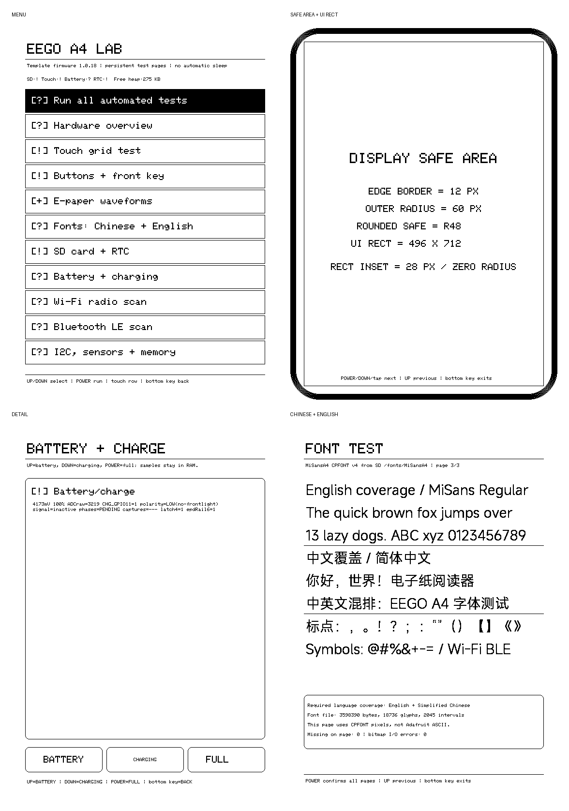

# Entity-device validation

本页是公开仓库的简明验证声明；它区分源码构建、framebuffer 证据和肉眼验收，
不把软件截图误称为实体面板照片。

## 已验证基线

| 项目 | 结果 |
|---|---|
| 模板版本 | 1.0.18 |
| 日期 | 2026-07-26 |
| 设备 | EEGO A4，无 LM3630A 前光版本 |
| ESP32-S3 / Flash / PSRAM | 通过诊断 |
| UC8279C 屏幕 | 启动、Full、Fast、四灰阶和安全区流程通过 |
| GSLX680 触控 | 方向、边界、九宫格和屏下键通过 |
| 实体侧键 | Up / Down / Power 通过 |
| SD / RTC / 电池 / 充电 | 自动诊断与人工阶段测试通过 |
| Wi-Fi / BLE / USB CDC | 扫描、命令和 framebuffer 回读通过 |
| 中文 / 英文 | 六档 CPFONT 资源实际读取与绘制通过 |
| 默认休眠 | 永不自动休眠；显式深睡有 3–60 秒定时唤醒 |

所有六个 PlatformIO 环境均已构建：

```text
eego_a4_diagnostics
eego_a4_quickstart
eego_a4_storage_rtc_battery
eego_a4_wifi_ble
eego_a4_safe_sleep
eego_a4_cpfont
```

## UI 证据

下面是从实体设备 RAM 回读的 1-bit framebuffer 合成图，不是模拟器，也不是
面板相机照片。它证明菜单、安全区域、详情页和中英文字体的最终像素与裁剪；
残影、对比度和波形仍以实体面板观察为准。



- contact sheet SHA-256:
  `80695eb79a4b09ab66587c43056568ddc4d53b667fc75c967f91decda085e41b`
- app SHA-256:
  `c6e320fd4cda06c4f5a8deb7557bf9ad1ec07c7641b1a41a8e3b888c53122161`
- full-image SHA-256:
  `4ee1c6f3821daad875504a85795728f254a4e7fa4776757ddd426107c80b5c70`

R60/12/R48 圆角安全区和 `28,28 496×712 R0` 普通 UI 矩形已在实体设备上
完成视觉验证。

## 当前源码构建边界

当前源码从空 `.pio` 缓存编译时，六个环境与发布校验全部通过。生成镜像：

- app SHA-256:
  `5c3ff8a0e64ec8c55c027994210650f15559be3cb03e384667f6ee563f0cc4dc`
- full-image SHA-256:
  `a64d9eeae64122269ebc5bb0ed9331f097ab1457c29949f9a1a8b3692a3a3467`

当前源码生成包没有刷入设备，因此上文真机结论严格绑定于已列出的实体机镜像
哈希。当前工具链默认把构建时间写入 app description，不同时间构建的二进制
SHA 不保证相同。每个新 tag 都必须重新做真机 smoke test，并记录该 tag 的生成
包哈希。

## 证据边界

- 只完整覆盖目前连接并测试的无前光变体。
- LM3630A 分支来自二进制行为和安全 ACK 探测，仍需要带前光实体机完整回归。
- 不发布设备 MAC、整片 Flash 备份、NVS 或原始第三方固件。
- 未确认板载扬声器、麦克风、LED、IMU 或环境传感器，因此不会声称支持。
- 新硬件 revision、LUT、触控表、分区或电源顺序变更会使本页的真机结论失效，
  必须重新验证并记录。
